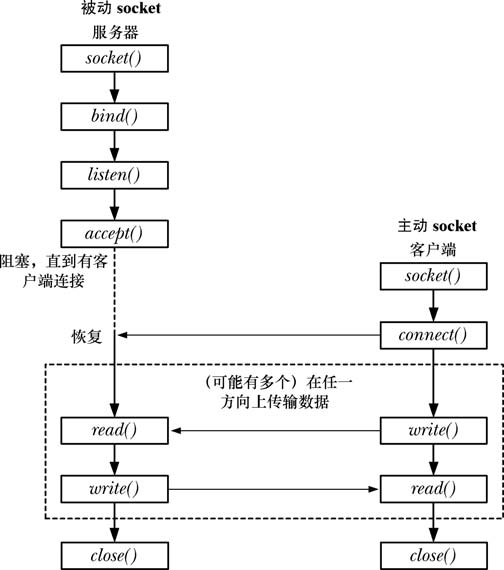
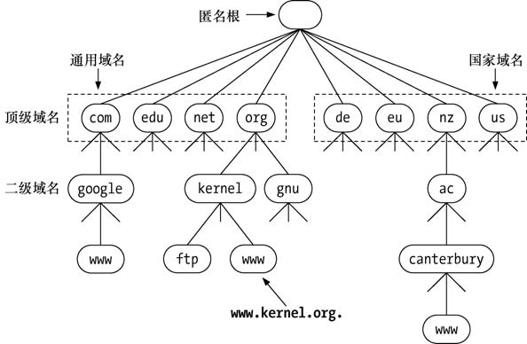
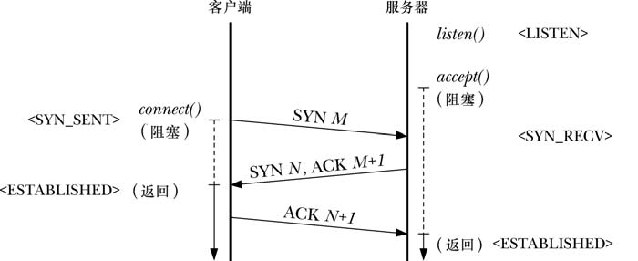
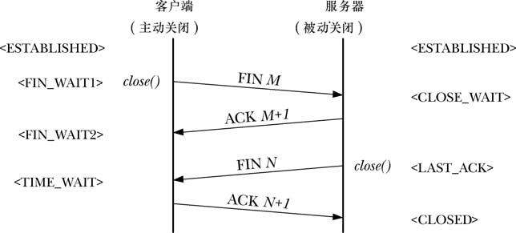

### Socket
每一种socket都至少提供了两种socket,分别是流和数据报
数据报使用了UDP协议，流使用TCP协议，各有优缺点
| 属性           | 流     | 数据报 |
|--------------|------|------|
| 可靠的传送   | 是   | 否   |
| 消息边界保留 | 否   | 是   |
| 面向连接     | 是   | 否   |

### socket
    #include <sys/types.h>
    #include <sys/socket.h>

    int socket(int domain, int type, int protocol);
domain,指定通信协议族，常见的协议族有以下
|值           |含义          |
|-------------|--------------|
|AF_INET      |IPV4网络协议  |
|AF_INET6     |IPV6网络协议  |
|AF_UNIX      |本地进程间通信|
|AF_PACKET    |访问底层网络  |

tpye,表示套接字的传输方式，常见的有
|值              |含义              |
|----------------|------------------|
|SOCK_STREAM     |TCP               |
|SOCK_DGRAM      |UDP               |
|SOCK_RAM        |原始套接字        |
|SOCK_SEQPACKET  |序列包            |

protocol通常为0
socket返回值为新建的socket的套接字描述符，返回值为-1时表示失败
### bind
    #include <sys/types.h>
    #include <sys/socket.h>
    #include <netinet/in.h>

    int bind(int sockfd, const struct sockaddr *addr, socklen_t addrlen);
sockfd就是socket的返回值，套接字描述符

addr是指向结构体sockaddr的指针，sockaddr具体为
    struct{
        sa_family_t sa_family;
        char sa_date[14];
    }
主要用来将各种domain转化为一个统一的结构

addrlen指定结构体的大小

### listen
    #include<sys/socket.h>

    int liste(int sockfd,int backlog);
sockfd是由socket创建的并返回的套接字描述符，必须是SOCK_STREAM类型的TCP套接字

backlog控制等待连接的队列的大小，设定已完成连接的队列的最大长度

成功返回0,失败返回-1

### accept
    #include <sys/socket.h>

    int accept(int sockfd,struct sockaddr* addr,socklen_t*addrlen);
与bind类似，参数基本相同，addr用于存放客户端地址，addrlen表示结构体的大小

注意，accept是服务端接受客户端连接的，如果未存在连接，就会一直堵塞到有连接为止

成功返回新的socket,失败返回-1

原来的socket是监听套接字，只能用于连接，新的socket是专门用于通信的

### connect
    #include <sys/socket.h>
    int connect(int sockfd, const stuct socksddr *addr,socklen_t addrlen);
参数基本与accept相同，功能也类似

注意，当客户端连接服务端失败后，需要重新建立一个socket来再次尝试连接

### close
终止连接，可以将引用了socket的文件描述符都用close关闭，连接就会终止

### shutdown
    #include <sys/socket.h>
    int shutdown(int sockfd,int how)
关闭套接字通道
sockfd socket套接字
how 一系列参数

### 专用于套接字的系统I/O调用
    #include <sys/socket.h>

    ssize_t recv(int sockfd,void* buffer,size_t length)
    ssize_t send(int fd, const void *buf, size_t n, int flags);

### 获取套接字地址
    #include <sys/socket.h>
    //获取本地套接字绑定的地址和端口
    int getsockname(int sockfd, struct sockaddr* addr,socklen_t* addrlen);
    //获取对端套接字的地址和端口
    int getpeername(int sockfd, struct sockaddr* addr,socklen_t* addrlen);

网络字节序是大端序（高位字节在低位内存，低位字节在高位内存），而inter和amd等cpu（主机字节序）使用的是小端序（与大端序相反），为了更好的通信，就需要有一些函数来转换
|函数             |作用           |字节数          |
|-----------------|---------------|----------------|
|htons            |主机->网络     |2               |
|htonl            |主机->网络     |4               |
|ntohs            |网络->主机     |2               |
|ntohl            |网络->主机     |4               |

### socket地址
socket地址通常存在sockaddr中，由此又生出sockaddr_in sockaddr_in6来分别对应IPv4和IPv6,以更详细的提供地址信息，与此同时，二者也可以通过强制转换为sockaddr*来填入不同的函数需求

    struct sockaddr {
        sa_family_t sa_family;  // 地址族（AF_INET / AF_INET6）
        char sa_data[14];       // 地址数据（长度固定为 14 字节）
    };
***
    #include <netinet/in.h>

    struct sockaddr_in {
        sa_family_t    sin_family;   // 地址族，必须设为 AF_INET（IPv4）
        in_port_t      sin_port;     // 端口号（需要使用 htons() 转换）
        struct in_addr sin_addr;     // IPv4 地址（网络字节序）
        char           sin_zero[8];  // 保留字段，通常填 0
    };
***
    #include <netinet/in.h>

    struct sockaddr_in6 {
        sa_family_t     sin6_family;    // 地址族，必须设为 AF_INET6（IPv6）
        in_port_t       sin6_port;      // 端口号（需要使用 htons() 转换）
        uint32_t        sin6_flowinfo;  // 流信息（通常设为 0）
        struct in6_addr sin6_addr;      // IPv6 地址（网络字节序）
        uint32_t        sin6_scope_id;  // 作用域 ID（仅在链路本地地址中使用）
    };
其中比较重要的是struct in_addr 和 struct in6_addr表示地址（网络字节序）

### DNS域名系统
为了更好的管理越来越多的主机，设计了DNS来解决这个问题，将ip映射到每个域名上，更方便用户访问，而域名通过DNS解析成ip地址，供电脑使用，DNS解析具体可分为递归和迭代

递归则是由本地服务器开始，依次迭代每一台其他服务器进行查询

### TCP工作流程

1. 客户端向服务器发送一个SYN报文，包含自己的序列号，后处于<SYN_SENT>状态，此时是堵塞状态，服务器端保持<LISTEN>状态，也是阻塞状态，等待请求
2. 在收到客户端发来的请求后，先确认SYN报文，无误后，返回自己的初始序列号以及设定了SYN和ACK控制位的报文后，处于<SYN_RECV>状态
3. 客户端收到服务器的报文后，再次发送ACK报文包含服务端的序列号来确认服务器端的SYN报文，后双方处于数据传输状态<ESTABLISHED>

1. 客户端执行主动关闭，发送FIN报文给服务器，后处于<FIN_WAITI>
2. 服务器收到FIN报文后返回ACK报文作为响应,后处于<CLOSE_WAITI>
3. 服务器关闭己方连接，发送FIN报文到客户端,后处于<LAST_ACK>,客户端处于<TIME_WAIE2>
4. 客户端发送ACK响应，来确认服务器端发来的FIN报文,此时处于<TIME_WAIT>，服务器端关闭
